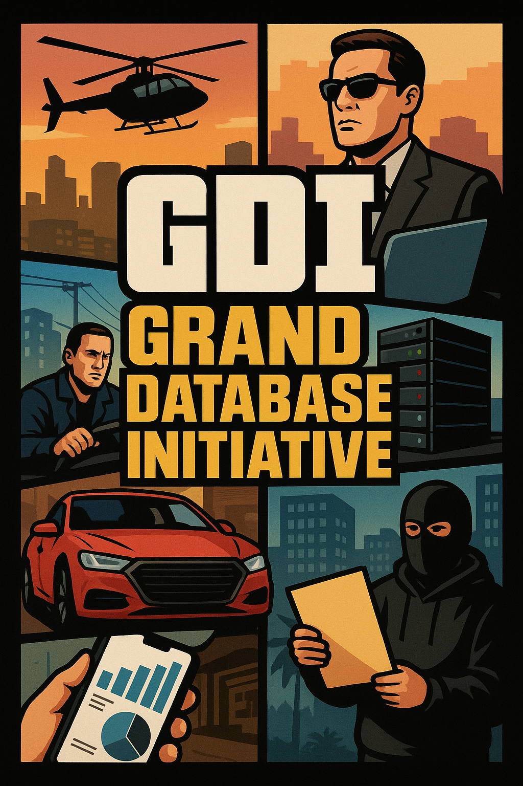

<h1 align="center"> GRAND DATABASE INITIATIVE </h1>

  

🎮 _Projeto para disciplina Gerenciamento de Dados e Informações 25.2_

👮 _Equipe:_

- ~~Me~~
- ~~Myself~~
- ~~I~~
- **Michael Felipe dos Santos (mfs6)**
- **Enzo Gurgel Bissoli (egb2)**
- **Ykaro dos Santos Albuquerque (ysa)**
- **Kaylanne Eduarda (kess)**

👑 _Monitor:_

- ~~Vinícius de Sousa Rodrigues (vsr)~~
- **Victória Tauanny de Paula da Silva (vtps)**

## 💵 Objetivo do projeto

Motivar o aluno a aprofundar os conceitos da disciplina, ao aplicá-los de forma prática num projeto desenvolvido sobre um tema de escolha própria.

## 🌎 Descrição do minimundo

O tema escolhido é o jogo Grand Theft Auto (GTA). Esse é um jogo de mundo aberto que combina ação, exploração e uma narrativa numa cidade viva e interativa. Assim como em GTA, o Grand Database Initiative oferece um mundo aberto — mas aqui, o território é feito de dados e o poder vem da informação!
